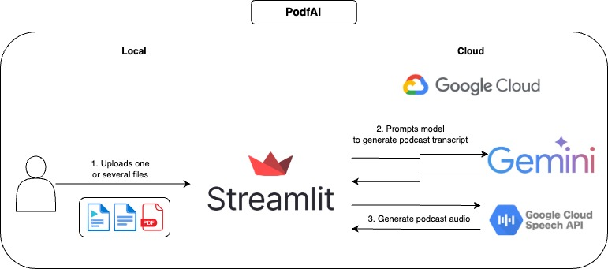
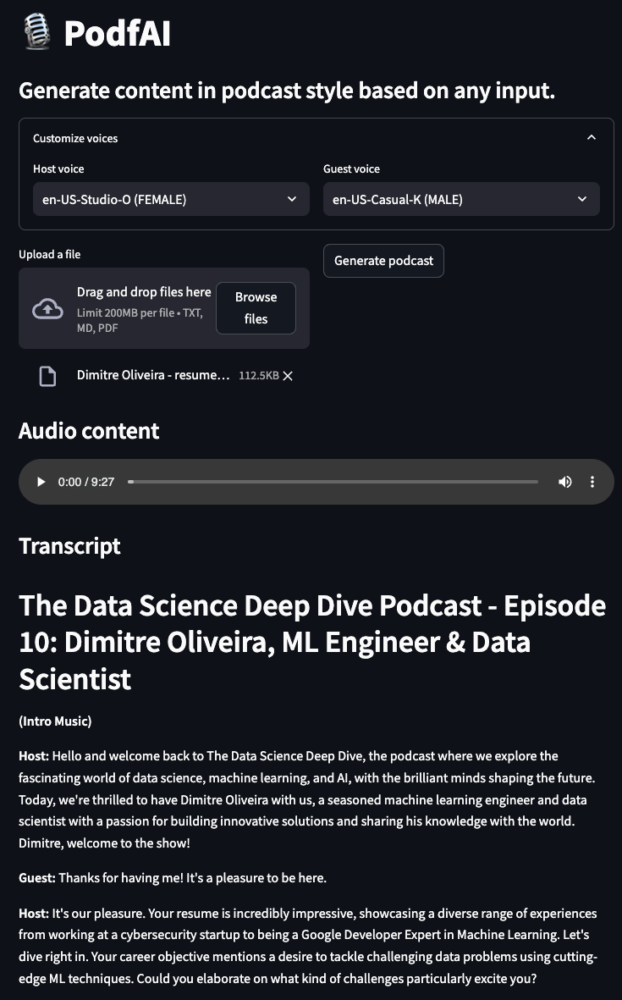

# PodfAI
This APP allows the user to create content in the style of podcasts based on the provides files. Some example would be providing a paper, lecture, project description, personal resume or many others.

# How it works



# How to use
1. Provide one or more files.
2. Optionally customize the voices of the guest and host, you can [check the voice samples here.](https://cloud.google.com/text-to-speech/docs/voices)
3. Click on "Generate podcast" and wait a few moments.
4. Play the audio and feel free to follow along the textual transcript.

# Examples



# Local usage

## Setup
1. Clone the GitHub repository
```bash
https://github.com/dimitreOliveira/PodfAI.git
cd PodfAI
```
2. Create a new venv
```bash
python -m venv .venvs/podfai
```
3. Activate the venv
```bash
source .venvs/podfai/bin/activate
```
4. Install the requirements
```bash
make build
```

Altenatively you can also run using `pip`
```bash
pip install -r requirements
```
5. Setup the Google API dependencies
- Follow [this guide](https://github.com/googleapis/google-cloud-python/tree/main/packages/google-cloud-texttospeech#python-client-for-google-cloud-text-to-speech) or [this other one](https://cloud.google.com/text-to-speech/docs/libraries).

## Running the APP

To star the APP run the Make command below
```bash
make app
```

Altenatively you can also run using plain Python
```python
streamlit run src/app.py
```

### Configs
Feel free to change the default configs to change the APP behavior or ajust to your needs.
```
vertex:
  project: {VERTEX_AI_PROJECT}
  location: {VERTEX_AI_LOCATION}
transcript:
  model_id: gemini-1.5-pro-002
  transcript_len: 5000
  max_output_tokens: 8192
  temperature: 1
  top_p: 0.95
  top_k: 32
```
- **vertex**
  - **project:** Project name used by Vertex AI.
  - **location:** Project location used by Vertex AI.
- **transcript**
  - **model_id:** Model used to create the podcast transcript.
  - **transcript_len:** Suggested transcript length.
  - **max_output_tokens:** Maximum number of tokens generated by the model.
  - **temperature:** Temperature controls the degree of randomness in token selection. Lower temperatures are good for prompts that expect a true or correct response, while higher temperatures can lead to more diverse or unexpected results. With a temperature of 0 the highest probability token is always selected
  - **top_p:** Top-p changes how the model selects tokens for output. Tokens are selected from most probable to least until the sum of their probabilities equals the top-p value. For example, if tokens A, B, and C have a probability of .3, .2, and .1 and the top-p value is .5, then the model will select either A or B as the next token (using temperature)
  - **top_k:** Top-k changes how the model selects tokens for output. A top-k of 1 means the selected token is the most probable among all tokens in the model’s vocabulary (also called greedy decoding), while a top-k of 3 means that the next token is selected from among the 3 most probable tokens (using temperature)

# TODO
- Support voice cloning
- Support other languages
- Support other input types (pdf, iamges, videos, YouTube urls)
- Add example notebook to run in Colab
- Reproduce workflow with open source models
- Experiment with agentic workflows to improve the podcast transcript

# References
- [Google cloud - Text-to-Speech client libraries](https://cloud.google.com/text-to-speech/docs/libraries)
- [Setup Google cloud TTS locally](https://github.com/googleapis/google-cloud-python/tree/main/packages/google-cloud-texttospeech#python-client-for-google-cloud-text-to-speech)
- [Google cloud TTS voice list](https://cloud.google.com/text-to-speech/docs/voices)''


# Contributing
If you are interested in contibuting to this project, thanks a lot! before creating your PR make sure to lint your code running the command below:

```bash
make lint
```

# Acknowledgments
- **Google Cloud credits are provided for this project.** This project was possible thanks for the support of Google's ML Developer Programs team.
- This project was based on Google's [NotebookLM](https://notebooklm.google.com), which aside from the podcast-style conten, has many other features, make sure to check it.